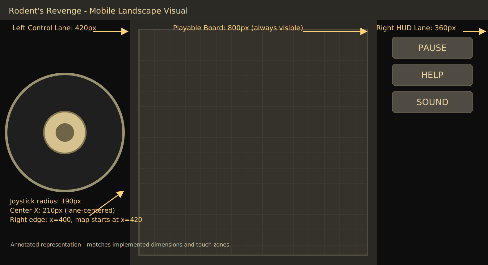
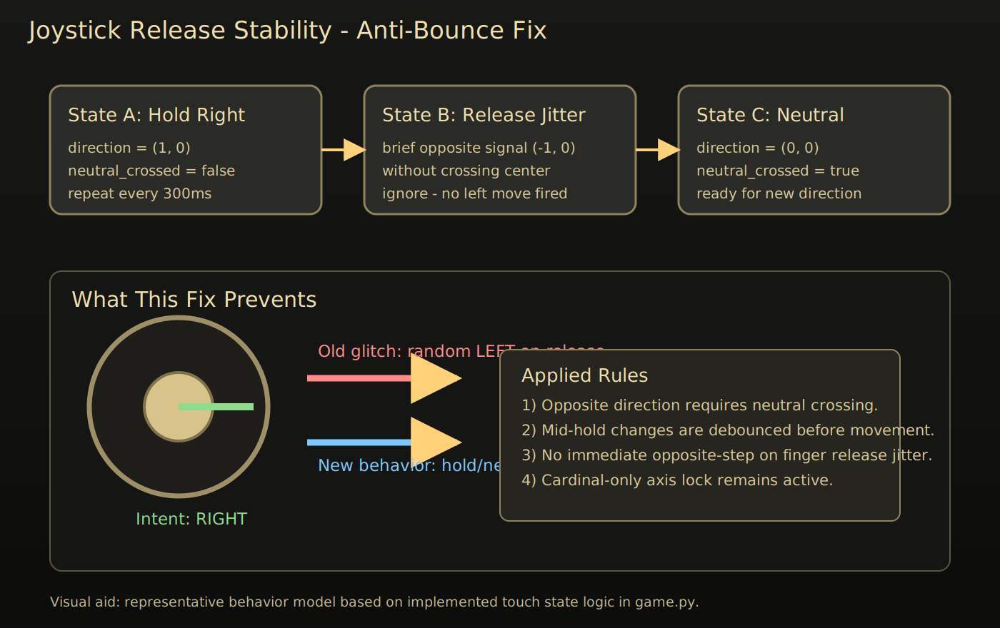
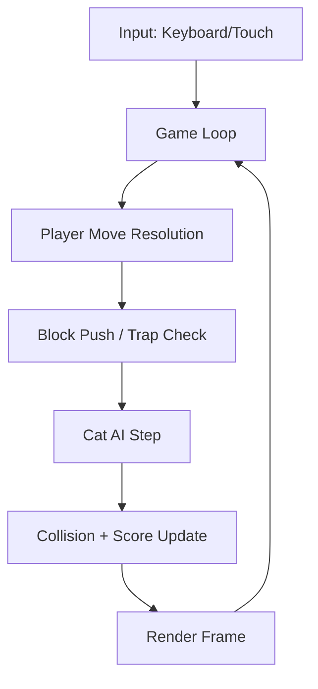
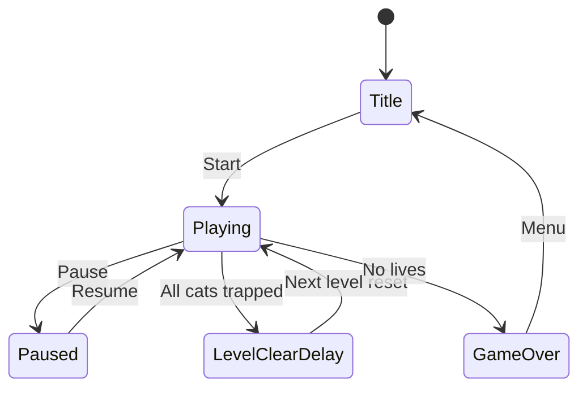

# Rodent's Revenge - Python Fan Remake

<div align="center">


Unofficial open-source remake inspired by the classic Microsoft game Rodent's Revenge (1991).

</div>

> [!IMPORTANT]
> This project is a fan remake and is not affiliated with Microsoft. It is built for nostalgia, learning, and gameplay experimentation.

## Table Of Contents

- [What This Project Is](#what-this-project-is)
- [Current Status](#current-status)
- [Gameplay Summary](#gameplay-summary)
- [How Scoring Works](#how-scoring-works)
- [Visual Style And Fidelity Direction](#visual-style-and-fidelity-direction)
- [Mobile And Web Experience](#mobile-and-web-experience)
- [Annotated Visuals](#annotated-visuals)
- [Installation And Quick Start](#installation-and-quick-start)
- [Controls](#controls)
- [Difficulty Modes](#difficulty-modes)
- [Level Design Model](#level-design-model)
- [Why Some Maps Felt Impossible](#why-some-maps-felt-impossible)
- [Architecture Overview](#architecture-overview)
- [Project Structure](#project-structure)
- [Testing](#testing)
- [Docker](#docker)
- [Web Deployment](#web-deployment)
- [Troubleshooting](#troubleshooting)
- [Roadmap](#roadmap)
- [Contributing](#contributing)
- [Credits And Attribution](#credits-and-attribution)

## What This Project Is

This repository contains a full gameplay implementation of a Rodent's Revenge style puzzle game using Python and pygame-ce. The core loop is intentionally faithful to the original feel: cats pursue the mouse, the player pushes blocks to trap cats, trapped cats turn into cheese, and levels escalate pressure over time.

The project is also designed to run in browsers through pygbag/WebAssembly, so the same game logic is playable on desktop and on touch devices without a separate codebase.

## Current Status

| Area | Status | Notes |
| --- | --- | --- |
| Core gameplay loop | Complete | Cat AI, trapping, scoring, level clear flow are stable |
| Preset levels (1-10) | Active tuning | Being refined for classic feel and solvability |
| Procedural levels (11+) | Complete | Seeded generation with density progression |
| Desktop controls | Complete | Keyboard first-class support |
| Mobile controls | Complete | Fixed joystick + touch action buttons |
| Web deployment | Complete | GitHub Actions + GitHub Pages |
| Automated tests | Complete | 48 gameplay tests currently passing |

> [!NOTE]
> The game title and loading copy use Rodent's Revenge naming consistently.

## Gameplay Summary

The mouse survives by manipulating pushable blocks and controlling space. Cats are threats that become resources only after being trapped. That trap-first rhythm is the heart of the game design, and everything in level layout should support this: open routes for setup, pressure from cat entry points, and enough movable blocks to create tactical options.

### Win Condition

1. Trap all cats in the room.
2. Cats convert into cheese.
3. Optionally collect cheese for bonus points.
4. Advance to the next room.

### Lose Condition

- Contact with a cat costs a life.
- Lose all lives and the run ends.

## How Scoring Works

| Event | Points |
| --- | --- |
| Move step | 0 |
| Cheese pickup | +25 |
| Single trapped cat | +100 |
| Multi-trap bonus (per extra cat) | +150 |
| Level clear bonus | +300 |

### Combo Formula

For $n$ cats trapped in one resolution step:

$$
\text{trap score} = n \cdot 100 + (n-1) \cdot 150
$$

Example with $n=3$:

$$
3 \cdot 100 + 2 \cdot 150 = 600
$$

## Visual Style And Fidelity Direction

The current direction is classic Windows-era readability with modern polish where it does not alter gameplay semantics. That means strong contrast, clear tile semantics, and sprite silhouettes that stay recognizable at movement speed.

### Tile Semantics

| Tile | Meaning | Design Priority |
| --- | --- | --- |
| Green block (`B`) | Pushable trap material | Highest gameplay readability |
| Blue wall (`#`) | Static obstacle | Should shape flow but not over-constrain |
| Cheese (`C`) | Reward pickup | Sparse in early levels to keep trap focus |
| Cat spawn (`X`) | Threat source | Usually near outer regions |

> [!TIP]
> If a level feels unfair, first reduce interior wall density, then verify there are multiple push lanes from center to at least one edge corridor.

## Mobile And Web Experience

The game supports desktop and touch interfaces through the same runtime logic.

- Left lane: large fixed virtual joystick.
- Center: active board area.
- Right lane: pause/help/sound and context actions.

For web builds, the loader is patched in CI for cleaner copy and mobile-friendly behavior. Loading text is branded as Rodent's Revenge.

## Annotated Visuals

### Mobile layout zones



### Joystick release stability



## Installation And Quick Start

### Requirements

- Python 3.10+
- pip
- SDL-compatible environment (desktop)

### Local desktop run

```bash
git clone https://github.com/hkevin01/rodents-revenge.git
cd rodents-revenge
python -m venv .venv
source .venv/bin/activate
pip install -r requirements.txt
PYTHONPATH=src python -m rodents_revenge.main
```

### Web build run

```bash
source .venv/bin/activate
pip install -r requirements-web.txt
python -m pygbag --build src/rodents_revenge
```

> [!NOTE]
> The build output is generated under the package build directory used by pygbag tooling.

## Controls

### Keyboard

| Input | Action |
| --- | --- |
| Arrow keys / WASD | Move mouse |
| `P` | Pause toggle |
| `H` | Help overlay toggle |
| `M` | Sound toggle |
| `Enter` | Start/confirm/menu actions |
| `Esc` | Exit to menu (web-safe behavior) |

### Touch

| Gesture / Button | Action |
| --- | --- |
| Drag virtual joystick | Four-way movement |
| PAUSE | Pause/resume |
| HELP | Show/hide controls help |
| SND ON/OFF | Audio toggle |

## Difficulty Modes

| Mode | Cat Delay Adjustment | Cat Count Adjustment |
| --- | --- | --- |
| Easy | Slower | -1 |
| Normal | Baseline | 0 |
| Hard | Faster | +1 |

Progressive acceleration still applies as level number increases.

## Level Design Model

The game currently mixes handcrafted and generated content:

- Levels 1-10: handcrafted presets tuned for style and solvability.
- Levels 11+: seeded procedural maps with increasing block density and cat pressure.

### Preset design goals

1. Mouse starts center-ish to keep opening decisions meaningful.
2. Cat spawns bias toward outer areas.
3. Interior has many pushable blocks and limited static walls.
4. At least one viable path to begin trap setup without requiring luck.

### Progression table

| Range | Source | Typical Feel |
| --- | --- | --- |
| 1-3 | Preset | Intro trap loops, forgiving movement lanes |
| 4-6 | Preset | Higher pressure, tighter timing |
| 7-10 | Preset | Dense tactical boards, faster threat convergence |
| 11+ | Seeded | Systematic scaling by level tier |

## Why Some Maps Felt Impossible

When maps become too wall-heavy inside the main play region, the player loses the ability to reposition blocks and build traps under pressure. That causes apparent dead states that feel unfair even if a formal solution exists.

To avoid this, current tuning emphasizes:

- More green pushable blocks than blue walls in preset interiors.
- Fewer hard partitions in center lanes.
- Symmetric pressure where possible, but not at the cost of playability.

> [!IMPORTANT]
> Fidelity to the original look is important, but solvability and readable decision space come first. A nostalgic layout that repeatedly yields dead starts is not a good remake experience.

## Architecture Overview





## Project Structure

| Path | Purpose |
| --- | --- |
| `src/rodents_revenge/game.py` | Main logic: state, rendering, AI, level generation |
| `src/rodents_revenge/main.py` | Runtime entrypoint |
| `src/rodents_revenge/scores.py` | Score persistence |
| `tests/test_game_logic.py` | Gameplay and regression tests |
| `.github/workflows/pygbag.yml` | Web build and deployment pipeline |
| `assets/docs/` | Documentation visuals |

## Testing

Run the full gameplay suite:

```bash
source .venv/bin/activate
PYTHONPATH=src .venv/bin/python -m pytest -q tests/test_game_logic.py
```

Static syntax check:

```bash
source .venv/bin/activate
.venv/bin/python -m py_compile src/rodents_revenge/game.py
```

## Docker

```bash
docker compose -f docker/docker-compose.yml run --rm test
```

Use Docker when you need deterministic CI-like behavior without host SDL differences.

## Web Deployment

GitHub Actions builds and publishes the pygbag output to GitHub Pages.

### Workflow summary

| Step | What happens |
| --- | --- |
| Checkout | Pull latest repo state |
| Python setup | Install runtime + dependencies |
| Web build | Compile pygame app via pygbag |
| Loader patch | Apply branding/mobile usability adjustments |
| Publish | Deploy to `gh-pages` |

## Troubleshooting

<details>
<summary><strong>Game window opens but controls do not respond</strong></summary>

Confirm the window has focus and that your keyboard layout is not intercepting arrow keys. On web, tap once on the canvas before using keys.

</details>

<details>
<summary><strong>Touch movement feels jittery</strong></summary>

The joystick is axis-locked to cardinal movement. Keep thumb drags clearly horizontal or vertical instead of diagonal.

</details>

<details>
<summary><strong>Web page still shows old loader text</strong></summary>

Force-refresh the browser to invalidate cached assets after a new deployment.

</details>

## Roadmap

- [ ] Continue preset level fidelity pass based on original screenshot patterns.
- [ ] Add optional visual debug overlay for map solvability checks.
- [ ] Improve sprite animation frames while preserving pixel-art readability.
- [ ] Add optional accessibility palette variants.

## Contributing

Contributions are welcome. If you submit gameplay changes, include:

1. A short explanation of expected behavior.
2. Test updates when behavior intentionally changes.
3. Screenshots or short clips for major visual updates.

## Credits And Attribution

- Inspired by Rodent's Revenge, originally created by Christopher Lee Fraley.
- Additional asset attribution is documented in `assets/docs/ATTRIBUTION.md`.

---

If you are here for the classic puzzle feel, start at level 1, play on Normal, and focus on creating cat funnels before chasing cheese.